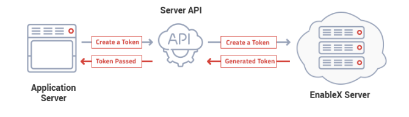

Server API, a RESTful API Service, is the single entry point to access EnableX services. The Server API is used for provisioning, requesting token to start WebRTC session and for post-session reporting.
# Overview
Only the Application Server may call the Server API.

Some applications may require a provisioning request from the Client End Point using your own service API. Following that, the Application Server can request Enablex Platform using Server API Call and process responses received.

# Basic Functions
The Server API is used for the following tasks:

**Provisioning Tasks**

- Create Room to carry out RTC Session
- Update Room Information
- Delete Room
- Get list of Rooms of your Application
- Get Room Information
**Transactional Tasks**

- Create Token to Join a Session
**Post Session Reporting**

- Get Call Detail Report (CDR)
- Get access to Recording, Transcoded Video, Chat Script files
# API Host URL
[Sever API Host](https://api.enablex.io/video/)

Every major version release of Server API will have a sub-directory named after the major version number. This is known as Base URL for a Server API Version, for example:

[Version Base URL](https://api.enablex.io/video/v2/)

All Server API Routes are mapped to the Version Base URL, for example:

[Rooms Route URL](https://api.enablex.io/video/v2/rooms)

# API Authentication
The Server API uses HTTP Basic Authentication mechanism to authenticate API calls. Each API call is validated via the authentication header.

The following Information is used as credentials to access Server API for your Application in the HTTP basic authentication header in the API call request

- Application ID or APP_ID as username
- Application Key or APP_KEY as Password
```
POST https://api.enablex.io/video/v2/rooms/
Authorization: Basic XXXXXX    
Content-Type: application/json
```
The *Authorizatio*n header in the above example contains a value XXXXX which is a base64 encoded string of the APP_ID:APP_KEY.

## How to get APP_ID & APP_KEY
All API Credentials are paired to a Project. You will need to create a Project first to receive the API credentials. To create Project, follow the given steps:

- Login to EnableX Portal
- Navigate: {Main Menu} Projects / Create New Project
Once your Project is created, you will receive an email with the Project’s Access Credentials, viz. APP_ID and APP_KEY.
# API Responses
The Server API call  make use of  JSON Result Code to determine if the API call is successful.

## Success JSON
Successful Server API calls will always return JSON with a 0 (zero) Result Code.
```
{    
     "result": 0,    
     ….
     ….
 }
```
## Error JSON
If unsuccessful, for whatever reason, the Server API will return a JSON with a non—zero result code. An error response in JSON will always carry 3 keys, viz. Result Code, Error, Description. See example below:
```
{    
     "result": "Non-Zero Result Code",   
     "error": "Short reason",
     "desc": "Descriptive information about the error / warning"
 }
```
## Result Code Grouping
The Result Codes of Server API are grouped into 5 categories as shown in the table below
| Code      | Category | Description |
| ----------- | ----------- | ----------- |
| 1xx      | Information       | Request received & processed       |
| 2xx   | Success        | Request received & accepted        |
| 3xx   | Redirection        | Action required to complete Request        |
| 4xx   | Client Error        | Illigble Request Syntax. Can’t be fulfilled        |
| 5xx   | Server Error        | Server failed to complete a legit Request        |