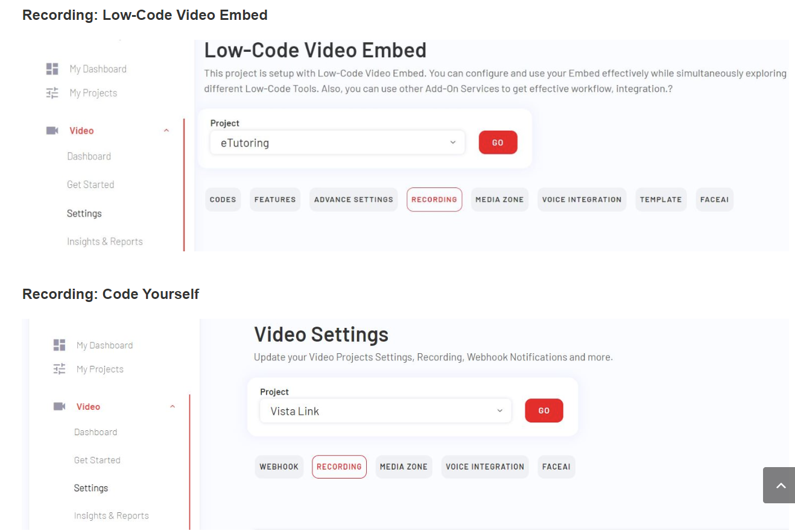
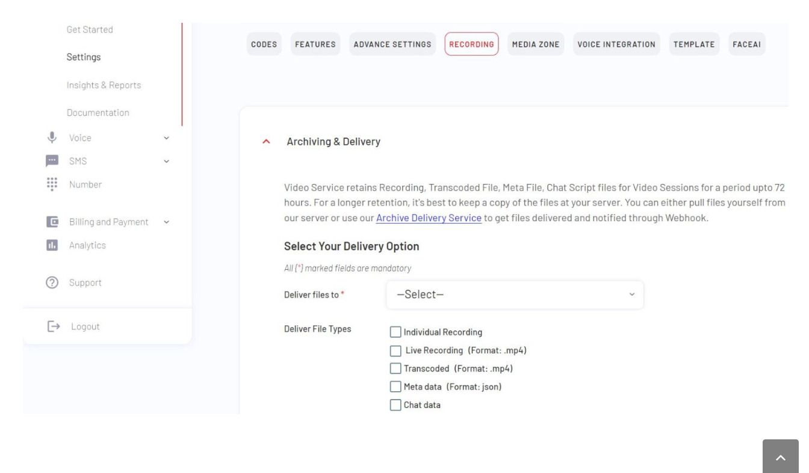
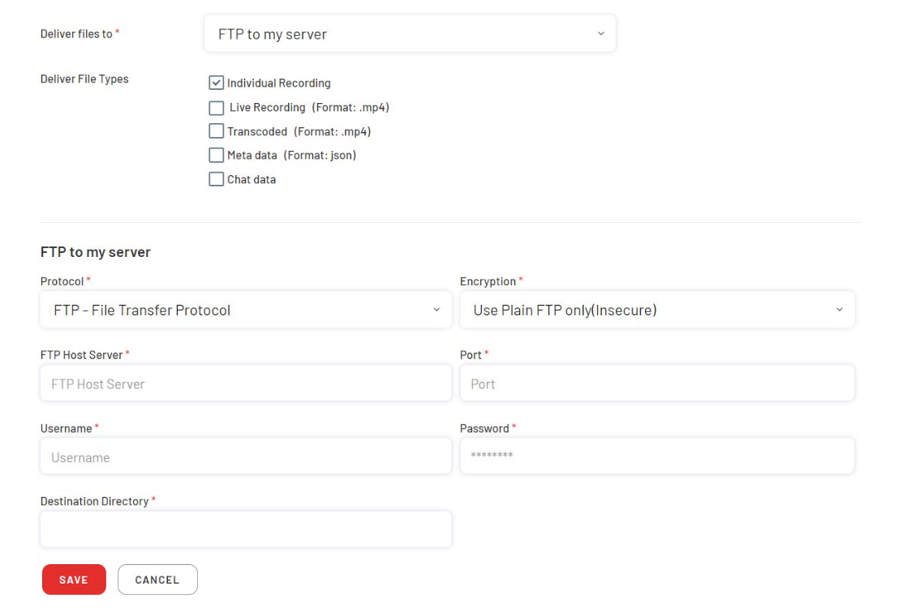
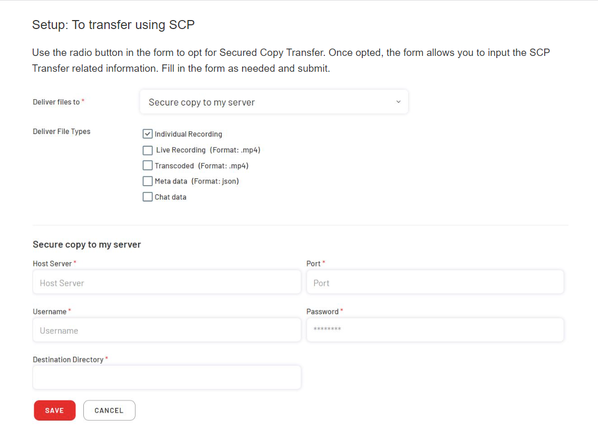
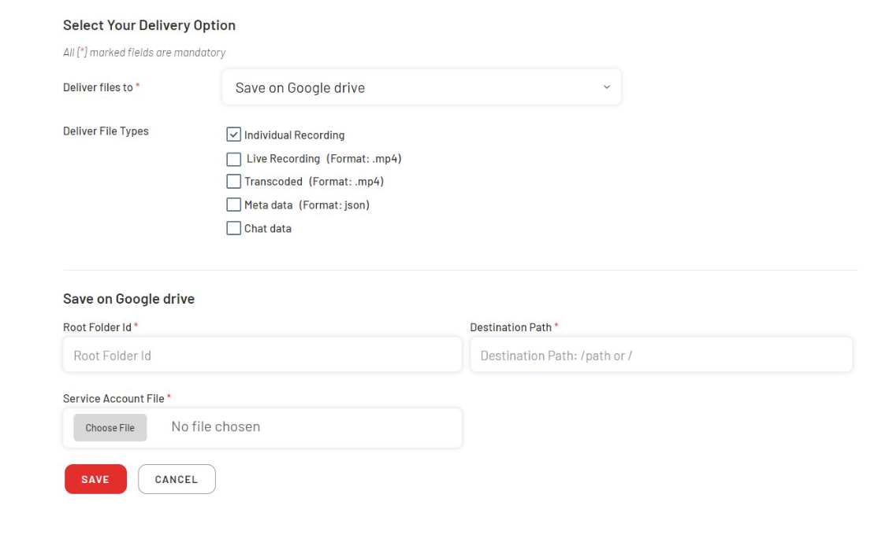
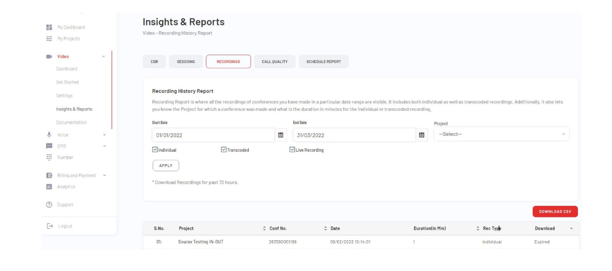

EnableX Video Recording Delivery Service allows you to upload your recorded files to a designated server. Currently, you can upload them to FTP/SFTP host or Amazon S3 bucket, Google Drive and Microsoft Azure.
# Overview
EnableX Video Recording Delivery Service allows you to upload the recorded video session to your preferred server that you have selected in your project. Recorded files are transferred in batches rather than an instant upload.

EnableX Recording Delivery Service current supports file transfer to the following Services / Host Servers:

- FTP / SFTP
- SCP
- AWS S3
- Google Drive
- Microsoft Azure
# Setup Recording Delivery
Recording Delivery Service is based on individual project settings. Each project can have different Delivery Mode and Access Details. However, you can use the same Delivery Mode and Access Details against multiple project to get files delivered. Delivery Service keeps transferred files organized in sub-folders named after room-id/conf-num for easy reference.

To setup Recording Delivery:

- Login to the Portal
- Navigate to “Projects / My Projects”.
- To get started with EnableX video services, go to “Get Started” under “Video” in the Left Bar. “Select Project” to choose whether you want low code integration or will prefer to code yourself for the selected project. In case if you have set this preference for your project, clicking on the project navigates to the “Settings” page.
- Next, go to the “Recording” tab under the “Settings” option to select your delivery option.

# Recording
- You get a form to setup type of files to transfer (Individual Recordings / Live Recording / Transcoded Files); opt and enter Access Credentials to transfer file to opted Host/Service Provider.
- Apart from Recording & Transcoded Files, you can also opt to transfer your Chat-Script and Session Meta Information File(s).
- Select the transfer option to deliver your files.

## Setup: To transfer to FTP/SFTP Host
Use the radio button in the form to opt for FTP/SFTP Transfer. Once opted, the form allows you to input the FTP/SFTP Transfer related information. Fill in the form as needed and submit.

## Setup: To transfer using SCP
Use the radio button in the form to opt for Secured Copy Transfer. Once opted, the form allows you to input the SCP Transfer related information. Fill in the form as needed and submit.

## Setup: To transfer to AWS S3
Use the radio button in the form to opt for AWS S3 Transfer. Once opted, the form allows you to input AWS S3 Transfer related information. Fill in the form as needed and submit.

## Setup: To transfer to Google Drive
Use the radio button in the form to opt for Google Drive. Once opted, the form allows you to input Google Drive Transfer related information. Fill in the form as needed and submit.

## Setup: To transfer to Microsoft Azure
Use the radio button in the form to opt for Microsoft Azure. Once opted, the form allows you to input Microsoft Azure Transfer related information. Fill in the form as needed and submit.

## Delivery Notification
EnableX also notifies your Application about a successful file transfer though a HTTP post on a designated Webhook URL.

See [Video Notification Webhook](./video-notification-webhook.md) to know about Notification Service
# Other Modes to get Recordings
In case you don’t need Recording Delivery, you may get access to your Video Session Recordings through API and Portal.
## Use Server API
Using Server API you can fetch a list of Recordings through a HTTP GET request to its archive route. You may use the following filters to get the right set recordings as desigred:

- For a Period – For a given From and To date
- For a Room ID
- For a Room ID within a Period
- For a specific Session – For a given Conference Number
After getting the Report, you may need to do HTTP GET to each of the URLs given in the Report to download files individually.
See [Get Recordings & Chat-Scripts](./get-recordings-chat-scripts.md)
## Use Portal Report
Portal has Report for Video Session Recordings with many filter options. The Report has direct download links for Individual Recording Files, Live Recording Files and Transcoded Files.

**Note**: The download link gets expired after 72 hours.

Follow the steps given below to download Recordings:

- Login to Portal
- Navigate to Video > Insight & Reports > Recordings
- Click “Download” link against a Video Session to download the recording
- You can also download the CSV report as per the filter condition

